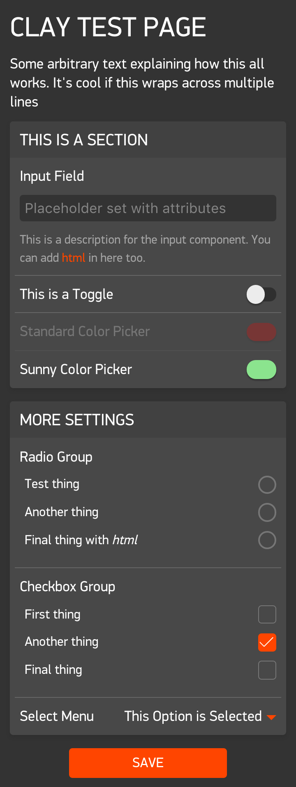

# Clay
Clay is a JavaScript library that makes it easy to add offline configuration pages to your Pebble apps. All you need to get started is a couple lines of JavaScript and a JSON file; no servers or HTML required. 

Clay will by default automatically handle the 'showConfiguration' and 'webviewclosed' events traditionally implemented by developers to relay configuration settings to the watch side of the app. This step is not required when using Clay, since each config item is given the same `messageKey` as defined in `package.json` (or PebbleKit JS Message Keys on CloudPebble), and is automatically transmitted once the configuration page is submitted by the user. Developers can override this behavior by [handling the events manually](#handling-the-showconfiguration-and-webviewclosed-events-manually).

Clay is distributed as a [Pebble package](https://developer.pebble.com/guides/pebble-packages/) so it is super easy to include in your project. If you are upgrading from v0.1.x of Clay you need to follow the [migration guide](#migrating-from-v01x-to-v1x) before you can get started.

If you would like to contribute to Clay, check out the [contributing guide.](CONTRIBUTING.md)

# Getting Started (SDK 3.13 or higher)

1. Run `pebble package install pebble-clay` to install the package in your project
2. Create a JSON file called `config.json` and place it in your `src/js` directory.
3. In order for JSON files to work you may need to change a line in your `wscript` from `ctx.pbl_bundle(binaries=binaries, js=ctx.path.ant_glob('src/js/**/*.js'))` to `ctx.pbl_bundle(binaries=binaries, js=ctx.path.ant_glob(['src/js/**/*.js', 'src/js/**/*.json']))`.
4. Your `index.js` (`app.js` in SDK 3) file needs to `require` clay and your config file, then be initialized. Clay will by default automatically handle the 'showConfiguration' and 'webviewclosed' events. Copy and paste the following into the top of your `index.js` file:

  ```javascript
  var Clay = require('pebble-clay');
  var clayConfig = require('./config.json');
  var clay = new Clay(clayConfig);
  ```
5. Ensure `pebble.enableMultiJS` is set to true in your `package.json`.
6. Next is the fun part - creating your config page. Edit your `config.json` file to build a layout of elements as described in the sections below.
7. Make sure you have defined all of your `messageKeys` in your `package.json`. More info on how that works [here.](https://developer.pebble.com/guides/communication/using-pebblekit-js/#defining-keys)

# Getting Started (CloudPebble)

1. Ensure `JS Handling` is set to `CommonJS-style` in your project settings.
2. Under `Dependencies` in the project navigation, enter `pebble-clay` as the `Package Name` and `^1.0.0` for the `Version`. You may use any specific version you like, however using `^1.0.0` will ensure you receive all minor version updates.
4. Create a JavaScript file called `config.js` with the following content. This will act as your config's root array element, from which the rest of the page is built up:

  ```javascript
  module.exports = [];
  ```
5. Your `index.js` file needs to `require` clay and your config file, then be initialized. Clay will by default automatically handle the 'showConfiguration' and 'webviewclosed' events. Copy and paste the following into the top of your `app.js` file:

  ```javascript
  var Clay = require('pebble-clay');
  var clayConfig = require('./config');
  var clay = new Clay(clayConfig);
  ```
6. Next is the fun part - creating your config page. Edit your `config.js` file to build a layout of elements as described in the sections below.
7. Make sure you have defined all of your message keys using `Automatic assignment` in your project settings. More info on how that works [here.](https://developer.pebble.com/guides/communication/using-pebblekit-js/#defining-keys)

# Getting Started (Pebble.js)
If you are using [Pebble.js](https://developer.pebble.com/docs/pebblejs/) and would like to use Clay, The setup process is a little different. Pebble.js does not currently support message keys so you will have to use [v0.1.7](https://github.com/pebble/clay/releases/v0.1.7) of Clay. Follow the instructions in the [readme for that version.](https://github.com/pebble/clay/blob/v0.1.7/README.md) 

# Getting Started (Rocky.js)
If you are using [Rocky.js](https://developer.pebble.com/docs/rockyjs/) and would like to use Clay, please be aware that this is currently unsupported. It is possible to install the Clay package and override the 'showConfiguration' and 'webviewclosed' events and handle them manually, but Rocky.js does not currently support persistent storage, so the settings must be loaded from the phone each time. You can find an example of using Clay with Rocky.js [here](https://github.com/orviwan/rocky-leco-clay).

# Creating Your Config File

Clay uses JavaScript object notation (or JSON) to generate the config page for you. The structure of the page is up to you, but you do need to follow some basic rules. 

## Basic Config Structure 

Your root element **must** be an array. This represents the entire page. Inside this array you place your config items. Each config item is an object with some properties that configure how each item should be displayed. 

#### Example

NOTE for config.js (rather than config.json) a leading `module.exports =` is required.

```javascript
[
  { 
    "type": "heading", 
    "defaultValue": "Example Header Item" 
  }, 
  { 
    "type": "text", 
    "defaultValue": "Example text item." 
  }
]
```

## Components



### Section

Sections help divide up the page into logical groups of items. It is recommended that you place all your input-based items in at least one section. 

##### Properties

| Property | Type | Description |
|----------|------|-------------|
| type | string | Set to `section`. |
| items | array | Array of items to include in this section. |
| capabilities | array | Array of features that the connected watch must have for this section to be present |

##### Example

```javascript
{
  "type": "section",
  "items": [
    {
      "type": "heading",
      "defaultValue": "This is a section"
    },
    {
      "type": "input",
      "messageKey": "email",
      "label": "Email Address"
    },
    {
      "type": "toggle",
      "messageKey": "enableAnimations",
      "label": "Enable Animations"
    }
  ]
}
```

---

### Heading

**Manipulator:** [`html`](#html)

Headings can be used in anywhere and can have their size adjusted to suit the context. If you place a heading item at the first position of a section's `items` array then it will automatically be styled as the header for that section. 

##### Properties

| Property | Type | Description |
|----------|------|-------------|
| type | string | Set to `heading`. |
| id | string (unique) | Set this to a unique string to allow this item to be looked up using `Clay.getItemById()` in your [custom function](#custom-function). |
| messageKey | string (unique) | The AppMessage key matching the `messageKey` item defined in your `package.json`.  Set this to a unique string to allow this item to be looked up using `Clay.getItemsByMessageKey()` in your custom function. You must set this if you wish for the value of this item to be persisted after the user closes the config page. |
| defaultValue | string/HTML | The heading's text. |
| size | int | Defaults to `4`. An integer from 1 to 6 where 1 is the largest size and 6 is the smallest. (represents HTML `<h1>`, `<h2>`, `<h3>`, etc). |
| capabilities | array | Array of features that the connected watch must have for this item to be present |
| group | string | Set this to allow this item, along with other items sharing the same group to be looked up using `Clay.getItemsByGroup()` in your [custom function](#custom-function) |


##### Example

```javascript
{
  "type": "heading",
  "id": "main-heading",
  "defaultValue": "My Cool Watchface",
  "size": 1
}
```

---

### Text

**Manipulator:** [`html`](#html)

Text is used to provide descriptions of sections or to explain complex parts of your page. Feel free to add any extra HTML you require to the `defaultValue` 

##### Properties

| Property | Type | Description |
|----------|------|-------------|
| type | string | Set to `text`. |
| id | string (unique) | Set this to a unique string to allow this item to be looked up using `Clay.getItemById()` in your [custom function](#custom-function). |
| messageKey | string (unique) | The AppMessage key matching the `messageKey` item defined in your `package.json`.  Set this to a unique string to allow this item to be looked up using `Clay.getItemsByMessageKey()` in your custom function. You must set this if you wish for the value of this item to be persisted after the user closes the config page. |
| defaultValue | string/HTML | The content of the text element. |
| capabilities | array | Array of features that the connected watch must have for this item to be present |
| group | string | Set this to allow this item, along with other items sharing the same group to be looked up using `Clay.getItemsByGroup()` in your [custom function](#custom-function) |


##### Example

```javascript
{
  "type": "text",
  "defaultValue": "This will be displayed in the text element!",
}
```

---

### Input

**Manipulator:** [`val`](#val)

Standard text input field. 

##### Properties

| Property | Type | Description |
|----------|------|-------------|
| type | string | Set to `input`. |
| id | string (unique) | Set this to a unique string to allow this item to be looked up using `Clay.getItemById()` in your [custom function](#custom-function). |
| messageKey | string (unique) | The AppMessage key matching the `messageKey` item defined in your `package.json`.  Set this to a unique string to allow this item to be looked up using `Clay.getItemsByMessageKey()` in your custom function. You must set this if you wish for the value of this item to be persisted after the user closes the config page. |
| label | string | The label that should appear next to this item. |
| defaultValue | string | The default value of the input field. |
| description | string | Optional sub-text to include below the component |
| attributes | object | An object containing HTML attributes to set on the input field. Set `type` to values such as "email", "time", "date" etc to adjust the behavior of the component. |
| capabilities | array | Array of features that the connected watch must have for this item to be present |
| group | string | Set this to allow this item, along with other items sharing the same group to be looked up using `Clay.getItemsByGroup()` in your [custom function](#custom-function) |


##### Example

```javascript
{
  "type": "input",
  "messageKey": "email",
  "defaultValue": "",
  "label": "Email Address",
  "attributes": {
    "placeholder": "eg: name@domain.com",
    "limit": 10,
    "type": "email"
  }
}
```

---

#### Toggle

**Manipulator:** [`checked`](#checked)

Switch for a single item. 

##### Properties

| Property | Type | Description |
|----------|------|-------------|
| type | string | Set to `toggle`. |
| id | string (unique) | Set this to a unique string to allow this item to be looked up using `Clay.getItemById()` in your [custom function](#custom-function). |
| messageKey | string (unique) | The AppMessage key matching the `messageKey` item defined in your `package.json`.  Set this to a unique string to allow this item to be looked up using `Clay.getItemsByMessageKey()` in your custom function. You must set this if you wish for the value of this item to be persisted after the user closes the config page. |
| label | string | The label that should appear next to this item. |
| defaultValue | int\|boolean | The default value of the toggle. Defaults to `false` if not specified. |
| description | string | Optional sub-text to include below the component |
| capabilities | array | Array of features that the connected watch must have for this item to be present |
| group | string | Set this to allow this item, along with other items sharing the same group to be looked up using `Clay.getItemsByGroup()` in your [custom function](#custom-function) |


##### Example

```javascript
{
  "type": "toggle",
  "messageKey": "invert",
  "label": "Invert Colors",
  "defaultValue": true
}
```

---

#### Select

**Manipulator:** [`val`](#val)

A dropdown menu containing multiple options.

##### Properties

| Property | Type | Description |
|----------|------|-------------|
| type | string | Set to `select`. |
| id | string (unique) | Set this to a unique string to allow this item to be looked up using `Clay.getItemById()` in your [custom function](#custom-function). |
| messageKey | string (unique) | The AppMessage key matching the `messageKey` item defined in your `package.json`.  Set this to a unique string to allow this item to be looked up using `Clay.getItemsByMessageKey()` in your custom function. You must set this if you wish for the value of this item to be persisted after the user closes the config page. |
| label | string | The label that should appear next to this item. |
| defaultValue | string | The default value of the dropdown menu. Must match a value in the `options` array. |
| description | string | Optional sub-text to include below the component |
| options | array of objects | The options you want to appear in the dropdown menu. Each option is an object with a `label` and `value` property. |
| capabilities | array | Array of features that the connected watch must have for this item to be present |
| group | string | Set this to allow this item, along with other items sharing the same group to be looked up using `Clay.getItemsByGroup()` in your [custom function](#custom-function) |

##### Example

```javascript
{
  "type": "select",
  "messageKey": "flavor",
  "defaultValue": "grape",
  "label": "Favorite Flavor",
  "options": [
    { 
      "label": "", 
      "value": "" 
    },
    { 
      "label": "Berry",
      "value": "berry" 
    },
    { 
      "label": "Grape",
      "value": "grape" 
    },
    { 
      "label": "Banana",
      "value": "banana" 
    }
  ]
}
```

If you wish to use optgroups, then use the following format:

```javascript
{
  "type": "select",
  "messageKey": "flavor",
  "defaultValue": "grape",
  "label": "Favorite Flavor",
  "options": [
    { 
      "label": "", 
      "value": "" 
    },
    {
      "label": "Fruits",
      "value": [
        { 
          "label": "Berry",
          "value": "berry" 
        },
        { 
          "label": "Grape",
          "value": "grape" 
        },
        { 
          "label": "Banana",
          "value": "banana" 
        }
      ]
    }, 
    {
      "label": "Candy",
      "value": [
        { 
          "label": "Chocolate",
          "value": "chocolate" 
        },
        { 
          "label": "Cream",
          "value": "cream" 
        },
        { 
          "label": "Lollipop",
          "value": "lollipop" 
        }
      ]
    }
  ]
}
```

---

#### Color Picker

**Manipulator:** [`color`](#color)

A color picker that allows users to choose a color from the ones that are compatible with their Pebble smartwatch. 
The color picker will automatically show a different layout depending on the watch connected: 

 - Aplite (Firmware 2.x) - Black and white
 - Aplite (Firmware 3.x) - Black and white. Will also include gray (`#AAAAAA`) if `allowGray` is set to `true`
 - Basalt/chalk - The 64 colors compatible with color Pebble smartwatches. 

##### Properties

| Property | Type | Description |
|----------|------|-------------|
| type | string | Set to `color`. |
| id | string (unique) | Set this to a unique string to allow this item to be looked up using `Clay.getItemById()` in your [custom function](#custom-function). |
| messageKey | string (unique) | The AppMessage key matching the `messageKey` item defined in your `package.json`.  Set this to a unique string to allow this item to be looked up using `Clay.getItemsByMessageKey()` in your custom function. You must set this if you wish for the value of this item to be persisted after the user closes the config page. |
| label | string | The label that should appear next to this item. |
| defaultValue | string OR int | The default color. One of the [64 colors](https://developer.pebble.com/guides/tools-and-resources/color-picker/) compatible with Pebble smartwatches. Always use the uncorrected value even if `sunlight` is true. The component will do the conversion internally. |
| description | string | Optional sub-text to include below the component |
| sunlight | boolean | Use the color-corrected sunlight color palette if `true`, else the uncorrected version. Defaults to `true` if not specified. |
| layout | string OR array | Optional. Use a custom layout for the color picker. Defaults to automatically choosing the most appropriate layout for the connected watch. The layout is represented by a two dimensional array. Use `false` to insert blank spaces. You may also use one of the preset layouts by setting `layout` to: `"COLOR"`, `"GRAY"` or `"BLACK_WHITE"` |
| allowGray | boolean | Optional. Set this to `true` to include gray (`#AAAAAA`) in the color picker for aplite running on firmware 3 and above. This is optional because only a subset of the drawing operations support gray on aplite. Defaults to `false` |
| capabilities | array | Array of features that the connected watch must have for this item to be present |
| group | string | Set this to allow this item, along with other items sharing the same group to be looked up using `Clay.getItemsByGroup()` in your [custom function](#custom-function) |

##### Example

```javascript
{
  "type": "color",
  "messageKey": "background",
  "defaultValue": "ff0000",
  "label": "Background Color",
  "sunlight": true,
  "layout": [
    [false, "00aaff", false],
    ["0055ff", "0000ff", "0000aa"],
    [false, "5555ff", false]
  ]
}
```

##### Example

```javascript
{
  "type": "color",
  "messageKey": "background",
  "defaultValue": "ffffff",
  "label": "Background Color",
  "sunlight": false,
  "layout": "BLACK_WHITE"
}
```

##### Example

```javascript
{
  "type": "color",
  "messageKey": "background",
  "defaultValue": "aaaaaa",
  "label": "Background Color",
  "sunlight": false,
  "allowGray": true
}
```

---

#### Radio Group

**Manipulator:** [`radiogroup`](#radiogroup)

A list of options allowing the user can only choose one option to submit.

##### Properties

| Property | Type | Description |
|----------|------|-------------|
| type | string | Set to `radiogroup`. |
| id | string (unique) | Set this to a unique string to allow this item to be looked up using `Clay.getItemById()` in your [custom function](#custom-function). |
| messageKey | string (unique) | The AppMessage key matching the `messageKey` item defined in your `package.json`.  Set this to a unique string to allow this item to be looked up using `Clay.getItemsByMessageKey()` in your custom function. You must set this if you wish for the value of this item to be persisted after the user closes the config page. |
| label | string | The label that should appear next to this item. |
| defaultValue | string | The default selected item. Must match a value in the `options` array. |
| description | string | Optional sub-text to include below the component |
| options | array of objects | The options you want to appear in the radio group. Each option is an object with a `label` and `value` property. |
| capabilities | array | Array of features that the connected watch must have for this item to be present |
| group | string | Set this to allow this item, along with other items sharing the same group to be looked up using `Clay.getItemsByGroup()` in your [custom function](#custom-function) |

##### Example

```javascript
{
  "type": "radiogroup",
  "messageKey": "favorite_food",
  "label": "Favorite Food",
  "options": [
    { 
      "label": "Sushi", 
      "value": "sushi" 
    },
    { 
      "label": "Pizza", 
      "value": "pizza" 
    },
    { 
      "label": "Burgers", 
      "value": "burgers" 
    }
  ]
}
```

---

#### Checkbox Group

**Manipulator:** [`checkboxgroup`](#checkboxgroup)

A list of options where a user may choose more than one option to submit.

##### Properties

| Property | Type | Description |
|----------|------|-------------|
| type | string | Set to `checkboxgroup`. |
| id | string (unique) | Set this to a unique string to allow this item to be looked up using `Clay.getItemById()` in your [custom function](#custom-function). |
| messageKey | string (unique) | The AppMessage key matching the `messageKey` item defined in your `package.json`.  Set this to a unique string to allow this item to be looked up using `Clay.getItemsByMessageKey()` in your custom function. You must set this if you wish for the value of this item to be persisted after the user closes the config page. **NOTE:** The checkboxgroup component will expect you to have defined a `messageKey` in your `package.json` using array syntax. In the example below, the matching entry in the `package.json` would be `favorite_food[3]`. In CloudPebble, you must use `Automatic assignment` for message keys and the `Key Array Length` must match the number of options in the checkboxgroup |
| label | string | The label that should appear next to this item. |
| defaultValue | array of booleans | The default selected items. |
| description | string | Optional sub-text to include below the component |
| options | array of strings | The labels for each checkbox you want to appear in the checkbox group. |
| capabilities | array | Array of features that the connected watch must have for this item to be present |
| group | string | Set this to allow this item, along with other items sharing the same group to be looked up using `Clay.getItemsByGroup()` in your [custom function](#custom-function) |

##### Example

```javascript
{
  "type": "checkboxgroup",
  "messageKey": "favorite_food",
  "label": "Favorite Food",
  "defaultValue": [true, false, true],
  "options": ["Sushi", "Pizza", "Burgers"]
}
```

In the above example, Sushi and Burgers will be selected by default.

---

### Generic Button

**Manipulator:** [`button`](#button)

##### Properties

| Property | Type | Description |
|----------|------|-------------|
| type | string | Set to `button`. |
| id | string (unique) | Set this to a unique string to allow this item to be looked up using `Clay.getItemById()` in your [custom function](#custom-function). |
| defaultValue | string | The text displayed on the button. |
| primary | boolean | If `true` the button will be orange, if `false`, the button will be gray (defaults to `false`)|
| description | string | Optional sub-text to include below the component |
| capabilities | array | Array of features that the connected watch must have for this item to be present |
| group | string | Set this to allow this item, along with other items sharing the same group to be looked up using `Clay.getItemsByGroup()` in your [custom function](#custom-function) |

##### Example

```javascript
{
  "type": "button",
  "primary": true,
  "defaultValue": "Send"
}
```

---

### Range Slider

**Manipulator:** [`slider`](#slider)

The range slider is used to allow users to select numbers between two values. 

**NOTE** If you set the `step` property to anything less than `1`, 
it will multiply the final value sent to the watch by 10 to the power of the number of decimal places in the value of `step`.
Eg: If you set the `step` to `0.25` and the slider has value of `34.5`, the watch will receive `3450`. 
The reason why this is necessary, is because you can not send floats to the watch via `Pebble.sendAppMessage()`. 
This allows your users to still be able to input values that have decimals, 
you must just remember to divide the received value on the watch accordingly. 

##### Properties

| Property | Type | Description |
|----------|------|-------------|
| type | string | Set to `slider`. |
| defaultValue | number | The value of the slider. |
| label | string | The label that should appear next to this item. |
| min | number | The minimum allowed value of the slider. Defaults to `100` |
| max | number | The maximum allowed value of the slider. Defaults to `0` |
| step | number | The multiple of the values allowed to be set on the slider. The slider will snap to these values. This value also determines the precision used when the value is sent to the watch. Defaults to 1 |
| description | string | Optional sub-text to include below the component |
| capabilities | array | Array of features that the connected watch must have for this item to be present |
| group | string | Set this to allow this item, along with other items sharing the same group to be looked up using `Clay.getItemsByGroup()` in your [custom function](#custom-function) |

##### Example

```javascript
{
  "type": "slider",
  "messageKey": "slider",
  "defaultValue": 15,
  "label": "Slider",
  "description": "This is the description for the slider",
  "min": 10,
  "max": 20,
  "step": 0.25
},
```

---

### Submit

**Manipulator:** [`button`](#button)

The submit button for the page. You **MUST** include this component somewhere in the config page (traditionally at the bottom) or users will not be able to save the form. 

##### Properties

| Property | Type | Description |
|----------|------|-------------|
| type | string | Set to `submit`. |
| defaultValue | string | The text displayed on the button. |
| id | string (unique) | Set this to a unique string to allow this item to be looked up using `Clay.getItemById()` in your [custom function](#custom-function). |
| capabilities | array | Array of features that the connected watch must have for this item to be present |
| group | string | Set this to allow this item, along with other items sharing the same group to be looked up using `Clay.getItemsByGroup()` in your [custom function](#custom-function) |

##### Example

```javascript
{
  "type": "submit",
  "defaultValue": "Save"
}
```

---

### Message keys and array syntax

Clay supports (and requires in some cases) the use of array syntax for message keys. Also known as `Automatic assignment` in CloudPebble. More info [here.](https://developer.pebble.com/guides/communication/using-pebblekit-js/#defining-keys)

You can assign any component that does not return an array to a particular position in your message key. This is done by appending the position (zero indexed) wrapped in brackets to the end of the `messageKey` property. Do **NOT** include any spaces in your `messageKey`.

##### Example

```javascript
{
  "type": "toggle",
  "messageKey": "light_switch[1]",
  "label": "Invert Colors",
  "defaultValue": true
}
```
In the above example, the value of the item will be accessible with `MESSAGE_KEY_light_switch + 1` in your C code.

Components that return an array in their `.get()` method, such as the checkboxgroup will expect the corresponding message key to already be defined with the correct length. You **CAN NOT** use the array syntax in the `messageKey` property as this would be trying to create a 2 dimensional array.

##### Example

```javascript
{
  "type": "checkboxgroup",
  "messageKey": "favorite_food",
  "label": "Favorite Food",
  "defaultValue": [true, false, true],
  "options": ["Sushi", "Pizza", "Burgers"]
}
```
In the above example, the value of the item will be accessible with `MESSAGE_KEY_favorite_food`, `MESSAGE_KEY_favorite_food + 1`, and `MESSAGE_KEY_favorite_food + 2` in your C code.

---
### Showing items for specific platforms and features

If you want particular items or sections to only be present in the config based on the
connected watch's capabilities, you can include the "capabilities" property in the item. 
The "capabilities" property is an array of features that the connected watch must have
in order for the item or section to be included in the page. Note: all capabilities in 
the array must be present for item/section to be included. 

You can also prefix the capability with `NOT_` to negate the capability. Eg: `NOT_HEALTH` 
will only be included in the page if the device does **NOT** support health. 

**Warning:** Items that do not satisfy the capabilities will not be included in the page 
at all. You will not be able to use methods like `clayConfig.getItemByMessageKey()` to
obtain a reference to them. However, this does mean that you will be able to have
multiple items with the same `messageKey`as long as they do not both satisfy the
same conditions. 

##### Examples

```javascript
{
  "type": "text",
  "defaultValue": "This item will only be visible for watches that are rectangular and have a microphone"
  "capabilities": ["MICROPHONE", "RECT"],
}
```

```javascript
{
  "type": "section",
  "capabilities": ["NOT_HEALTH"],
  "items": [
    {
      "type": "text",
      "defaultValue": "Only visible for watches that do not support health"
    }
  ]
}
```

Below is the full list of capabilities 

| Capability | Description |
|------------|-------------|
| PLATFORM_APLITE | Running on Pebble/Pebble Steel.|
| PLATFORM_BASALT | Running on Pebble Time/Pebble Time Steel. |
| PLATFORM_CHALK | Running on Pebble Time Round. |
| PLATFORM_DIORITE | Running on Pebble 2 |
| PLATFORM_EMERY | Running on Time 2. |
| BW | Running on hardware that supports only black and white. |
| COLOR | Running on hardware that supports 64 colors. |
| MICROPHONE | Running on hardware that includes a microphone. |
| SMARTSTRAP | Running on hardware that includes a smartstrap connector. |
| SMARTSTRAP_POWER | Running on hardware that includes a powered smartstrap connector. |
| HEALTH | Running on hardware that supports Pebble Health and the HealthService API. |
| RECT | Running on hardware with a rectangular display. |
| ROUND | Running on hardware with a round display. |
| DISPLAY_144x168 | Running on hardware with a 144x168 pixels display. |
| DISPLAY_180x180_ROUND | Running on hardware with a 180x180 pixels round display. |
| DISPLAY_200x228 | Running on hardware with a 200x228 pixels display. |

## Manipulators 

Each component has a **manipulator**. This is a set of methods used to talk to the item on the page. 
At a minimum, manipulators must have a `.get()` and `.set(value)` method however there are also methods to assist in interactivity such as `.hide()` and `.disable()`. 
**NOTE:** There is currently no way to disable or hide an entire section. You must disable/hide each item in the section to achieve this effect. 

When the config page is closed, the `.get()` method is run on all components registered with an `messageKey` to construct the object sent to the C app.

Many of these methods fire an event when the method is called. You can listen for these events with `ClayItem.on()`. 
**NOTE** These events will only be fired if the state actually changes. 
Eg: If you run the `.show()` manipulator on an item that is already visible, the `show` event will not be triggered.

#### html

| Method | Returns | Event Fired | Description | 
|--------|---------|-------------| ------------|
| `.set( [string\|HTML] value)` | `ClayItem` | `change` | Sets the content of this item. |
| `.get()` | `string` | | Gets the content of this item. |
| `.hide()` | `ClayItem` | `hide` | Hides the item |
| `.show()` | `ClayItem` | `show` | Shows the item |

#### button

| Method | Returns | Event Fired | Description | 
|--------|---------|-------------| ------------|
| `.set( [string\|HTML] value)` | `ClayItem` | `change` | Sets the content of this item. |
| `.get()` | `string` | | Gets the content of this item. |
| `.disable()` |  `ClayItem` | `disabled` | Prevents this item from being clicked by the user. |
| `.enable()` |  `ClayItem` | `enabled` | Allows this item to be clicked by the user. |
| `.hide()` | `ClayItem` | `hide` | Hides the item |
| `.show()` | `ClayItem` | `show` | Shows the item |

#### val

| Method | Returns | Event Fired | Description | 
|--------|---------|-------------| ------------|
| `.set( [string] value)` | `ClayItem` | `change` | Sets the value of this item. |
| `.get()` |  `string` | | Gets the content of this item. |
| `.disable()` |  `ClayItem` | `disabled` | Prevents this item from being edited by the user. |
| `.enable()` |  `ClayItem` | `enabled` | Allows this item to be edited by the user. |
| `.hide()` | `ClayItem` | `hide` | Hides the item |
| `.show()` | `ClayItem` | `show` | Shows the item |

#### checked

| Method | Returns | Event Fired | Description | 
|--------|---------|-------------| ------------|
| `.set( [boolean\|int] value)` | `ClayItem` | `change` | Check/uncheck the state of this item. |
| `.get()` | `boolean` | | `true` if checked, `false` if not. **NOTE** this will be converted to a `1` or `0` when sent to the watch. See [`Clay.getSettings()`](#methods) |
| `.disable()` | `ClayItem` | `disabled` | Prevents this item from being edited by the user. |
| `.enable()` | `ClayItem` | `enabled` | Allows this item to be edited by the user. |
| `.hide()` | `ClayItem` | `hide` | Hides the item |
| `.show()` | `ClayItem` | `show` | Shows the item |

#### color

| Method | Returns | Event Fired | Description | 
|--------|---------|-------------| ------------|
| `.set( [string\|int] value)` | `ClayItem` | `change` | Sets the color picker to the provided color. If the value is a string, it must be provided in hex notation eg `'FF0000'`. |
| `.get()` | `int` | | Get the chosen color. This is returned as a number in order to make it easy to use on the watch side using `GColorFromHEX()`. |
| `.disable()` | `ClayItem` | `disabled` | Prevents this item from being edited by the user. |
| `.enable()` | `ClayItem` | `enabled` | Allows this item to be edited by the user. |
| `.hide()` | `ClayItem` | `hide` | Hides the item |
| `.show()` | `ClayItem` | `show` | Shows the item |

#### radiogroup

| Method | Returns | Event Fired | Description | 
|--------|---------|-------------| ------------|
| `.set( [string] value)` | `ClayItem` | `change` | Checks the radio button that corresponds to the provided value. |
| `.get()` |  `string` | | Gets the value of the checked radio button in the list. |
| `.disable()` | `ClayItem` | `disabled` | Prevents this item from being edited by the user. |
| `.enable()` | `ClayItem` | `enabled` | Allows this item to be edited by the user. |
| `.hide()` | `ClayItem` | `hide` | Hides the item |
| `.show()` | `ClayItem` | `show` | Shows the item |

#### checkboxgroup

| Method | Returns | Event Fired | Description | 
|--------|---------|-------------| ------------|
| `.set( [array] value)` | `ClayItem` | `change` | Checks the checkboxes that corresponds to the provided list of values. |
| `.get()` |  `Array.<string>` | | Gets an array of booleans representing the list the checked items. **NOTE:** each item in the array will be converted to an `int` when sent to the watch. See [`Clay.getSettings()`](#methods) |
| `.disable()` | `ClayItem` | `disabled` | Prevents this item from being edited by the user. |
| `.enable()` | `ClayItem` | `enabled` | Allows this item to be edited by the user. |
| `.hide()` | `ClayItem` | `hide` | Hides the item |
| `.show()` | `ClayItem` | `show` | Shows the item |

#### slider

| Method | Returns | Event Fired | Description | 
|--------|---------|-------------| ------------|
| `.set( [number] value)` | `ClayItem` | `change` | Sets the value of this item. |
| `.get()` |  `number` | | Gets the value of this item. |
| `.disable()` |  `ClayItem` | `disabled` | Prevents this item from being edited by the user. |
| `.enable()` |  `ClayItem` | `enabled` | Allows this item to be edited by the user. |
| `.hide()` | `ClayItem` | `hide` | Hides the item |
| `.show()` | `ClayItem` | `show` | Shows the item |

# Extending Clay

Clay is built to allow developers to add their own basic interactivity to the config page. This can be done in a number of ways:

## Handling The 'showConfiguration' and 'webviewclosed' Events Manually

Clay will by default, automatically handle the 'showConfiguration' and 'webviewclosed' events. This allows the `messageKey` of each config item to be automatically delivered to the `InboxReceivedHandler` on the watch side. If you wish to override this behavior and handle the events yourself, pass an object as the 3rd parameter of the Clay constructor with `autoHandleEvents` set to `false`.

Example:

```javascript
var Clay = require('pebble-clay');
var clayConfig = require('./config');
var clayConfigAplite = require('./config-aplite');
var clay = new Clay(clayConfig, null, { autoHandleEvents: false });

Pebble.addEventListener('showConfiguration', function(e) {
  
  // This is an example of how you might load a different config based on platform.
  var platform = clay.meta.activeWatchInfo.platform || 'aplite';
  if (platform === 'aplite') {
    clay.config = clayConfigAplite;
  }
  
  Pebble.openURL(clay.generateUrl());
});

Pebble.addEventListener('webviewclosed', function(e) {
  if (e && !e.response) {
    return;
  }

  // Get the keys and values from each config item
  var dict = clay.getSettings(e.response);

  // Send settings values to watch side
  Pebble.sendAppMessage(dict, function(e) {
    console.log('Sent config data to Pebble');
  }, function(e) {
    console.log('Failed to send config data!');
    console.log(JSON.stringify(e));
  });
});
```

## Clay API (app.js)

### `Clay([Array] config, [function] customFn, [object] options)`

#### Constructor Parameters

| Parameter | Type | Description |
|----------|-------|-------------|
| `config` | Array | The config that will be used to generate the configuration page |
| `customFn` | Function\|null | (Optional) The [custom function](#custom-function) to be injected into the generated configuration page.  |
| `options` | Object | (Optional) See below for properties |
| `options.autoHandleEvents` | Boolean | (Optional) Defaults to `true`. If set to `false`, Clay will not [auto handle the `showConfiguration` and `webviewclosed` events](#handling-the-showconfiguration-and-webviewclosed-events-manually) |
| `options.userData` | Any | (Optional) Any arbitrary data you want to pass to your config page. It will be available in your custom function as `this.meta.userData` |

#### Properties

| Property | Type | Description |
|----------|------|-------------|
| `.config` | Array | Copy of the config passed to the constructor and used for generating the page. |
| `.customFn` | Function | Reference to the custom function passed to the constructor. **WARNING** this is a direct reference, not a copy of the custom function so any modification you make to it, will be reflected on the original as well |
| `.meta` | Object | Contains information about the current user and watch. **WARNING** This will only be populated in the `showConfiguration` event handler. (See example above) |
| `.meta.activeWatchInfo` | watchinfo\|null | An object containing information on the currently connected Pebble smartwatch or null if unavailable. Read more [here](https://developer.pebble.com/docs/js/Pebble/#getActiveWatchInfo). |
| `.meta.accountToken` | String | A unique account token that is associated with the Pebble account of the current user. Read more [here](https://developer.pebble.com/docs/js/Pebble/#getAccountToken). |
| `.meta.watchToken` | String | A unique token that can be used to identify a Pebble device. Read more [here](https://developer.pebble.com/docs/js/Pebble/#getWatchToken). |
| `.meta.userData` | Any | A deep copy of the arbitrary data provided in the `options.userData`. Defaults to an empty object |
| `.version` | String | The version of Clay currently being used. |

#### Methods

| Method | Returns |
| -------|---------|
| `Clay( [array] config, [function] customFn=null, [object] options={autoHandleEvents: true})` <br> `config` - an Array representing your config <br> `customFn` - function to be run in the context of the generated page <br> `options.autoHandleEvents` - set to `false` to prevent Clay from automatically handling the "showConfiguration" and "webviewclosed" events | `Clay` - a new instance of Clay. |
| `.registerComponent( [ClayComponent] component )` <br> Registers a custom component. | `void`. |  
| `.generateUrl()` | `string` - The URL to open with `Pebble.openURL()` to use the Clay-generated config page. |
| `.getSettings( [object] response, [boolean] convert=true)` <br> `response` - the response object provided to the "webviewclosed" event <br> `convert` - Pass `false` to not convert the settings to be compatible with `Pebble.sendAppMessage()` | `Object` - object of keys and values for each config page item with an `messageKey`, where the key is the `messageKey` and the value is the chosen value of that item.  <br><br>This method will do some conversions depending on the type of the setting. Arrays will use message key array syntax to make the values of each item in the array available as individual message keys. Booleans will be converted to numbers. eg `true` becomes `1` and `false` becomes `0`. If the value is a number or an array of numbers and the optional property: "precision" is the power of precision (value * 10 ^ precision) and then floored. Eg: `1.4567` with a precision set to `3` will become `1456`. Pass `false` as the second parameter to disable this behavior. See the example below for how this all works |
| `.setSettings( [string] key, [*] value )` <br> `key` - The key for the setting you want to set. <br> `value` - The value of the setting you want to set. | `void` |
| `.setSettings( [object] settings )` <br> `settings` - An object of key/value pairs that you would like to update the settings with. eg `{ user_name: 'Emily', show_animations: true }` | `void` |

#### `.getSettings()` Example 

```javascript

// webviewclosed response
{
  "favorite_food": {"value": [1, 0, 1]},
  "cool_things_enabled": {"value": true},
  "user_name": {"value": "Jane Doe"},
  "date_of_birth[0]": {"value": 1989},
  "date_of_birth[1]": {"value": 11},
  "date_of_birth[2]": {"value": 28},
  "rating": {"value": 3.5, "precision": 1},
}

// resulting converted values

var messageKeys = require('message_keys');

messageKeys.favorite_food + 0 = 1;
messageKeys.favorite_food + 1 = 0;
messageKeys.favorite_food + 2 = 1;
messageKeys.cool_things_enabled = 1;
messageKeys.user_name = 'Jane Doe';
messageKeys.date_of_birth + 0 = 1989;
messageKeys.date_of_birth + 1 = 11;
messageKeys.date_of_birth + 2 = 28;
messageKeys.rating = 35;


``` 

---


## Custom Function

When initializing Clay in your `app.js` file, you can optionally provide a function that will be copied and run on the generated config page. 

**IMPORTANT:** This function is injected by running `.toString()` on it. If you are making use of `require` or any other dynamic features, they will not work. You must make sure that everything the function needs to execute is available in the function body itself. 

This function, when injected into the config page, will be run with `ClayConfig` as its context (`this`), and [**Minified**](#minified) as its first parameter.

Make sure to always wait for the config page to be built before manipulating items. You do this by registering a handler for the `Clay.EVENTS.AFTER_BUILD` event (see below). 

#### Example 

##### app.js

```javascript
var Clay = require('pebble-clay');
var clayConfig = require('./config');
var customClay = require('./custom-clay');
var userData = {token: 'abc123'}
var clay = new Clay(clayConfig, customClay, {userData: userData});
```

##### custom-clay.js

```javascript
module.exports = function(minified) {
  var clayConfig = this;
  var _ = minified._;
  var $ = minified.$;
  var HTML = minified.HTML;

  function toggleBackground() {
    if (this.get()) {
      clayConfig.getItemByMessageKey('background').enable();
    } else {
      clayConfig.getItemByMessageKey('background').disable();
    }
  }

  clayConfig.on(clayConfig.EVENTS.AFTER_BUILD, function() {
    var coolStuffToggle = clayConfig.getItemByMessageKey('cool_stuff');
    toggleBackground.call(coolStuffToggle);
    coolStuffToggle.on('change', toggleBackground);
    
    // Hide the color picker for aplite
    if (!clayConfig.meta.activeWatchInfo || clayConfig.meta.activeWatchInfo.platform === 'aplite') {
      clayConfig.getItemByMessageKey('background').hide();
    }
    
    // Set the value of an item based on the userData
    $.request('get', 'https://some.cool/api', {token: clayConfig.meta.userData.token})
      .then(function(result) {
        // Do something interesting with the data from the server
      })
      .error(function(status, statusText, responseText) {
        // Handle the error
      });
  });
  
};
```

## Clay API (Custom Function)

### `ClayConfig([Object] settings, [Array] config, [$Minified] $rootContainer)`

This is the main way of talking to your generated config page. An instance of this class will be passed as the context of your custom function when it runs on the generated config page. 

#### Properties

| Property | Type | Description |
|----------|------|-------------|
| `.EVENTS.BEFORE_BUILD` | String | Dispatched prior to building the page. |
| `.EVENTS.AFTER_BUILD` | String | Dispatched after building the page. |
| `.EVENTS.BEFORE_DESTROY` | String | Dispatched prior to destroying the page. |
| `.EVENTS.AFTER_DESTROY` | String | Dispatched after destroying the page. |
| `.config` | Array | Reference to the config passed to the constructor and used for generating the page. |
| `.meta` | Object | Contains information about the current user and watch |
| `.meta.activeWatchInfo` | watchinfo\|null | An object containing information on the currently connected Pebble smartwatch or null if unavailable. Read more [here](https://developer.pebble.com/docs/js/Pebble/#getActiveWatchInfo). |
| `.meta.accountToken` | String | A unique account token that is associated with the Pebble account of the current user. Read more [here](https://developer.pebble.com/docs/js/Pebble/#getAccountToken). |
| `.meta.watchToken` | String | A unique token that can be used to identify a Pebble device. Read more [here](https://developer.pebble.com/docs/js/Pebble/#getWatchToken). |
| `.meta.userData` | Any | The data passed in the `options.userData` of the [Clay constructor.](#clayarray-config-function-customfn-object-options) |


#### Methods

| Method | Returns |
|--------|---------|
| `.getAllItems()` | `Array.<ConfigItem>` - an array of all config items. |
| `.getItemByMessageKey( [string] messageKey )` | `ConfigItem\|undefined` - a single `ConfigItem` that has the provided `messageKey`, otherwise `undefined`. |
| `.getItemById( [string] id )` | `ConfigItem\|undefined` - a single `ConfigItem` that has the provided `id`, otherwise `undefined`. |
| `.getItemsByType( [string] type )` | `Array.<ConfigItem>` - an array of config items that match the provided `type`. |
| `.getItemsByGroup( [string] group )` | `Array.<ConfigItem>` - an array of config items that match the provided `group`. |
| `.serialize()` | `Object` - an object representing all items with an `messageKey` where the key is the `messageKey` and the value is an object with the `value` property set to the result of running `.get()` on the Clay item. If the Clay item has a `precision` property set, it is included in the object |
| `.build()` <br> Builds the config page. Will dispatch the `BEFORE_BUILD` event prior to building the page, then the `AFTER_BUILD` event once it is complete. If the config page has already been built, then the `ClayConfig.destroy()` method will be executed prior to building the page again. | `ClayConfig` |
| `.destroy()` <br> Destroys the config page. Will dispatch the `BEFORE_DESTROY` event prior to destroying the page, then the `AFTER_DESTROY` event once it is complete. This method wipes the config page completely, including all existing items. You will need to make sure that you re-attach your event handlers for any items that are replaced | `ClayConfig` |
| `.on( [string] events, [function] handler )` <br> Register an event to the provided handler. The handler will be called with this instance of `ClayConfig` as the context. If you wish to register multiple events to the same handler, then separate the events with a space | `ClayConfig` |
| `.off( [function] handler )` <br> Remove the given event handler. **NOTE:** This will remove the handler from all registered events. | `ClayConfig` |
| `.trigger( [string] name, [object] eventObj={} )` <br> Trigger the provided event and optionally pass extra data to the handler. | `ClayConfig` |
| `.registerComponent( [ClayComponent] component )` <br> Registers a component. You must register all components prior to calling `.build()`. This method is also available statically. | `Boolean` - `true` if the component was registered successfully, otherwise `false`.  |

---

### `ClayItem( [Object] config )`

#### Properties

| Property | Type | Description |
|----------|------|-------------|
| `.id` | String | The ID of the item if provided in the config. |
| `.messageKey` | String | The messageKey of the item if provided in the config. |
| `.config` | Object | Reference to the config passed to the constructer. |
| `$element` | $Minified | A Minified list representing the root HTML element of the config item. |
| `$manipulatorTarget` | $Minified | A Minified list representing the HTML element with **data-manipulator-target** set. This is generally pointing to the main `<input>` element and will be used for binding events. |


#### Methods

| Method | Returns |
|--------|---------|
| `.initialize( [ClayConfig] clay)` <br> You shouldn't ever need to run this method manually as it will automatically be called when the config is built. | `ConfigItem` |
| `.on( [string] events, [function] handler )` <br> Register an event to the provided handler. The handler will be called with this instance of `ClayItem` as the context. If you wish to register multiple events to the same handler, then separate the events with a space. Events will be registered against the `$manipulatorTarget` so most DOM events such as **"change"** or **"click"** can be listened for. | `ClayItem` |
| `.off( [function] handler )` <br> Remove the given event handler. **NOTE:** This will remove the handler from all registered events. | `ClayItem` |
| `.trigger( [string] name, [object] eventObj={} )` <br> Trigger the provided event and optionally pass extra data to the handler. | `ClayItem` |

In addition to the methods above, all the methods from the item's manipulator will be attached to the `ClayItem`. This includes `.set()` and `.get()`.

---

## Custom Components

Clay is also able to be extended using custom components. This allows developers to share components with each other. 

### Component Structure

Components are simple objects with the following properties.

#### `ClayComponent`

| Property | Type | Required | Description | 
|----------|------|----------|-------------|
| `name` | string | yes | This is the unique way to identify the component and will be used by the config item's `type`. | 
| `template` | string (HTML) | yes | This is the actual HTML content of the component. Make sure there is only **one** root node in the HTML. This HTML will be passed to Minified's `HTML()` method. Any properties provided by the config item will be made available to the template, eg: `label`. The template will also be provided with `clayId` as a unique way to set input `name` attributes. |
| `style` | string | no | Any extra CSS styles you want to inject into the page. Make sure to namespace your CSS with a class that is unique to your component in order to avoid conflicts with other components. |
| `manipulator` | string / manipulator | yes | Provide a string here to use one of the built-in manipulators, such as `val`. If an object is provided, it must have both a `.set(value)` and `.get()` method. |
| `defaults` | object | Only if your template requires it. | An object of all the defaults your template requires. |
| `initialize` | function | no | Method which will be called after the item has been added to the page. It will be called with the `ClayItem` as the context (`this`) and with [`minified`](#minified) as the first parameter and [`clayConfig`](#clayconfigobject-settings-array-config-minified-rootcontainer) as the second parameter |

### Registering a custom component. 

Components must be registered before the config page is built. The easiest way to do this is in your `app.js` after you have initialized Clay:

```javascript
var Clay = require('pebble-clay');
var clayConfig = require('./config.json');
var clay = new Clay(clayConfig);

clay.registerComponent(require('./my-custom-component'));
```

## Minified

[Minified](http://minifiedjs.com) is a super light JQuery-like library. We only bundle in a small subset of its functionality. Visit the [Minified Docs](http://minifiedjs.com/api/) for more info on how to use Minified. Below is the subset of methods available in Clay.

 - `$()`
 - `$$()`
 - `.get()`
 - `.select()`
 - `.set()`
 - `.add()`
 - `.ht()`
 - `HTML()`
 - `$.request()`
 - `promise.always()`
 - `promise.error()`
 - `$.off()`
 - `$.ready()`
 - `$.wait()`
 - `.on()`
 - `.each()`
 - `.find()`
 - `_()`
 - `_.copyObj()`
 - `_.eachObj()`
 - `_.extend()`
 - `_.format()`
 - `_.formatHtml()`
 - `_.template()`
 - `_.isObject()`

# Migrating from v0.1.x to v1.x

There were some changes in the 3.13 SDK that required Clay to undergo some major changes. For the majority of developers a simple find and replace over your config will do the trick.

### appKey is now messageKey.

You will need to update your config files and change any items that use `appKey` to `messageKey`

##### Example

```javascript
{
  "type": "toggle",
  "appKey": "invert",
  "label": "Invert Colors",
  "defaultValue": true
}
```
becomes:

```javascript
{
  "type": "toggle",
  "messageKey": "invert",
  "label": "Invert Colors",
  "defaultValue": true
}
```

### clayConfig.getItemByAppKey is now clayConfig.getItemByMessageKey.

If you have a [custom function](#custom-function) and are using the `clayConfig.getItemByAppKey()` method you will need to change this to `clayConfig.getItemByMessageKey()`

### clay.getSettings() will now by default, return an object where the keys are numbers.

In the past, `clay.getSettings()` would return something that looked like:

```javascript
{
  BACKGROUND_COLOR: 0,
  NAME: 'Jane Doe',
  ENABLE_TOOLS: 1
}
```

It now uses the values provided in the `message_keys` module to construct this object.
The new format looks something like:

```javascript
{
  10000: 0,
  10001: 'Jane Doe',
  10002: 1
}
```

If you wish to find out what keys are associated with what values, you must use the `message_keys` module.

```javascript
var messageKeys = require('message_keys');

Pebble.addEventListener('webviewclosed', function(e) {
  // Get the keys and values from each config item
  var claySettings = clay.getSettings(e.response);

  // In this example messageKeys.NAME is equal to 10001
  console.log('Name is ' + claySettings[messageKeys.NAME]); // Logs: "Name is Jane Doe"
});
```

**NOTE:** The above only applies to the default behavior of the method. If you pass
`false` to the second argument, a standard object will be returned with the `messageKey`
as the key.

```javascript

Pebble.addEventListener('webviewclosed', function(e) {

  clay.getSettings(e.response);
    /* returns:
    {
      10000: 0,
      10001: 'Jane Doe',
      10002: 1
    }
    */

  clay.getSettings(e.response, false);
    /* returns:
    {
      BACKGROUND_COLOR: {value: 0},
      NAME: {value: 'Jane Doe'},
      ENABLE_TOOLS: {value: true}
    }

    Notice that the value for ENABLE_TOOLS was not converted to a number from a boolean
    */
});

```

### Checkbox groups now use arrays.

In the previous version of Clay, checkbox groups would split the values of the items with zeros. This made for clumsy usage on the C side. Checkbox groups are now much simpler to use thanks to message keys. You will however need to update you config to the new format.

#### Changes:
 - `defaultValue` and the value that is returned by the `.get()` method is now an array of booleans.
 - `options` are now an array of labels and do not have their own value
 - Instead of splitting the result on the C side you now use the message key syntax. In the example below `MESSAGE_KEY_favorite_food + 2` would have a value of `1`

#### Old Format

```javascript
{
  "type": "checkboxgroup",
  "appKey": "favorite_food",
  "label": "Favorite Food",
  "defaultValue": ["sushi", "burgers"],
  "options": [
    {
      "label": "Sushi",
      "value": "sushi"
    },
    {
      "label": "Pizza",
      "value": "pizza"
    },
    {
      "label": "Burgers",
      "value": "burgers"
    }
  ]
}
```

#### New Format

```javascript
{
  "type": "checkboxgroup",
  "messageKey": "favorite_food",
  "label": "Favorite Food",
  "defaultValue": [true, false, true],
  "options": ["Sushi", "Pizza", "Burgers"]
}
```

### Clay is now a pebble package

You no longer need to download a file into your project. Clay is now a Pebble package so you can go ahead and delete your `clay.js` and follow the getting started guide above to install clay in your project.

Prior to SDK 3.13, `require` paths were handled in a non-standard way. When requiring modules, the name of the module was sufficient (ie. `require('config.json')`). However, with the release of SDK 3.13, the require paths changed so that you now have to require the module by using its path relative to the file it's being required in. This means requiring the config module now is done in app.js by using `require('./clay-config.json')`. An incorrect path would result in an error similar to this:
   ```
   [14:16:03] javascript> JavaScript Error:
   Error: Cannot find module 'clay-config.json'
       at Object.loader.require (loader.js:66:11)
       at _require.require (loader.js:54:48)
       at Object.loader (src/js/app.js:1:1)
       at _require (loader.js:57:10)
       at Object.loader.require (loader.js:69:10)
   ```
